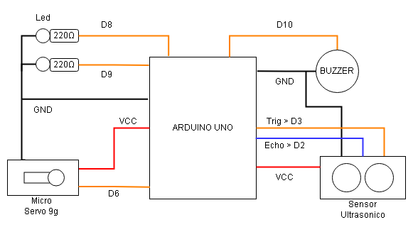

# semaforo

Este sistema funciona de maneira semelhante a um semáforo ou pedágio, onde você precisa esperar sua vez para passar e prosseguir, mas se a luz ainda estiver vermelha (proibido de passar), um alarme soará e você será multado.

